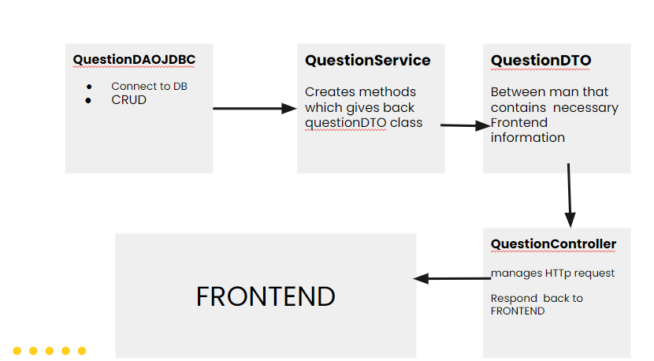

# Stack Overflow 2.0 Table of Content

- [Introduction](#introduction)
- [Technologies Used](#technologies-used)
- [System Architecture](#system-architecture)
- [Database Design](#database-design)
- [Getting Started](#getting-started)

## Introduction
Welcome to  Stack Overflow 2.0. This question-and-answer website aims to serve as a minimalistic alternative to the original website. The main page lists all questions with details and answers. Users are able to create, read, delete and update  their questions and  answers. Main emphasis of this project was to use and practice SOLID, OOP and Clean Code principles within the Java Spring Boot framework.

## Technologies Used

- [**Java Spring Boot Framework**](https://spring.io/projects/spring-boot)

  

- [**React**](https://reactjs.org/)

  

- [**Postgres**](https://www.postgresql.org/)

  

## System Architecture
Repository contains both the Front and Backend part of the application and its  using Model View Controller layers.



Flowchart  above demonstrates how data is handled and navigated from the database to the Frontend. Requests from the frontend also use the same logic just backwards. Moreover Frontend doesn't do calculations, only displays the data, SQL handles the data manipulation.

- QuestionDAOJDBC is directly connected to the Postgres Database.

- QuestionDAO  serves as a crucial abstraction layer bridging the gap between the low-level data access operations implemented in QuestionDAOJDBC and the higher-level business logic encapsulated in QuestionService

- QuestionService:positioned between QuestionDAO and QuestionController, orchestrates question-related operations and ensures coordinated data flow between the Frontend and Backend.

- QuestionController: handles HTTP requests related to questions.
  It is responsible for coordinating the flow of data between the frontend and the backend for question-related operations.


## Database Design
Postgresql is responsible for storing and handling  and manipulating  questions and answers by using two tables.

Questions Schema contains five columns :
- question_id
- user_id
- question_title
- question_description
- question_date

Similarly Answers Schema  contains five columns:
- answer_id
- user_id
- answer_title
- answer_description
- answer_date

## Getting Started

1. Clone this repository to your local machine.
   ```sh
   git clone https://github.com/github_username/stackoverflow-2.0.git
   ```

2. Set up environment variables for PostgreSQL connection. Create an `.env` file in the same directory as your `docker-compose.yml` file with the following content:

   ```shell
   POSTGRES_USER=mydbuser
   POSTGRES_PASSWORD=mydbpassword
   ```
   Replace `mydbuser` and `mydbpassword` with your desired PostgreSQL username and password.

3. From the terminal, navigate to the directory containing the `docker-compose.yml` file and start the application using Docker Compose:
   ```sh
   docker-compose up
   ```

4. Your application is now running. You can access the services from your web browser:

   - Your Spring Boot backend service at: `localhost:8080`

   - Your frontend React app at: `localhost:3000`

5. When you're done working with the application, you can stop it by pressing `Ctrl+C` in the terminal where you ran `docker-compose up`, or in a new terminal tab run:

   ```sh
   docker-compose down
   ```
